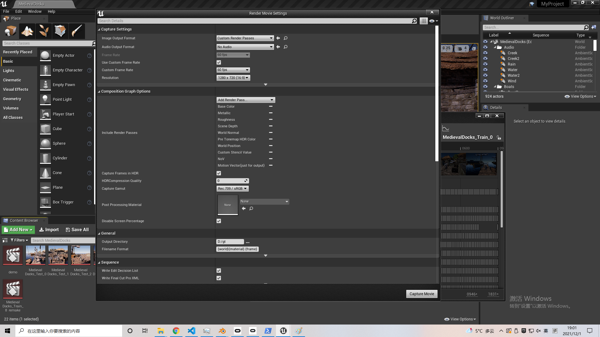

# ExtraNet
This is the repository for the tools and network source codes for our paper [ExtraNet: Real-time Extrapolated Rendering for Low-latency Temporal Supersampling][ACM Transactions on Graphics (Proceedings of SIGGRAPH Asia 2021)].
## Python lib requirements
Please refer to the **requirements.txt**.

## How to generate dataset
We provide a custom built Unreal Engine for generating dataset. Any Unreal Engine scenes requiring engine version <= 4.25.3 can be opened by our build.
The link of our build: https://drive.google.com/drive/folders/1ZUbct6Z2T3gGhbxjQU0-u2PPflwYv-UZ?usp=sharing. This custom build is modified by Hengjun Ma.

**If higher version of Unreal Engine is needed, please refer to the instructions in ExtraNet/EngineModificationGuide.**

### Required scene settings when exporting data
To make sure the exported data can be handled by ExtraNet itself, please follow the instructions below:
1. Sprites, decals, particle effects, volumetric effects, tranlucent effects should removed from scenes (because of lacking either albedo or motion vector information).
2. Postprocessing should be disabled when exporting data to make sure the images exported is "Pre-postprocess" ones.
3. Make sure to enable DX12 RHI.
4. Make sure to enable Ray Tracing in Unreal settings. (Honestly, this step should have not been compulsory, but currently because of some unknown reasons, if Ray Tracing is not enabled, the shading effects will be incorrect.)
5. Make sure to enable stencil in project setting: project setting -> Rendering::Postprocessing -> Enable with Stencil. And for dynamic objects, make sure to enable *Render Custom depth pass* and set Custom Depth Stencil Value(any value larger than 0, and different objects should have different values) in object properties.


### Generate raw data
We use Unreal Engine's sequence to generate data. More information about sequence and Sequencer, please refer to Unreal Engine documentation.
For a recorded sequence, settings shown below are required before capturing frames:




Make sure to store frames from different sequences in different folders. After recording, images with index of **0000** should be manual deleted. 

### Preprocessing
After recording frames, please refer to the instructions of preprocessing in ExtraNet/DataPreprocessing to generate data for training and testing.

## Model
### Training
The training script is: Model/train.py.
```python
python train.py
```
(Before running this script, make sure to set **basePaths** in config.py.)
### Testing
The testing script is: Model/inference.py.
```python
python inference.py
```
## Integration into Unreal Engine
https://github.com/fuxihao66/UnrealEngine/tree/UE425ExtraNet_active (still under development..)

(before accessing this repo, please refer to https://www.unrealengine.com/ue4-on-github to associate your GitHub account with your Unreal Engine account)
## TensorRT Inference
For network inference speed test, please refer to https://github.com/fuxihao66/ExtraNetTRTInference.
## Citation
If you find the tools or codes useful in your research, please cite:
```
@article{10.1145/3478513.3480531,
author = {Guo, Jie and Fu, Xihao and Lin, Liqiang and Ma, Hengjun and Guo, Yanwen and Liu, Shiqiu and Yan, Ling-Qi},
title = {ExtraNet: Real-Time Extrapolated Rendering for Low-Latency Temporal Supersampling},
year = {2021},
issue_date = {December 2021},
publisher = {Association for Computing Machinery},
address = {New York, NY, USA},
volume = {40},
number = {6},
doi = {10.1145/3478513.3480531},
journal = {ACM Trans. Graph.},
month = {dec},
articleno = {278},
numpages = {16}
}
```


